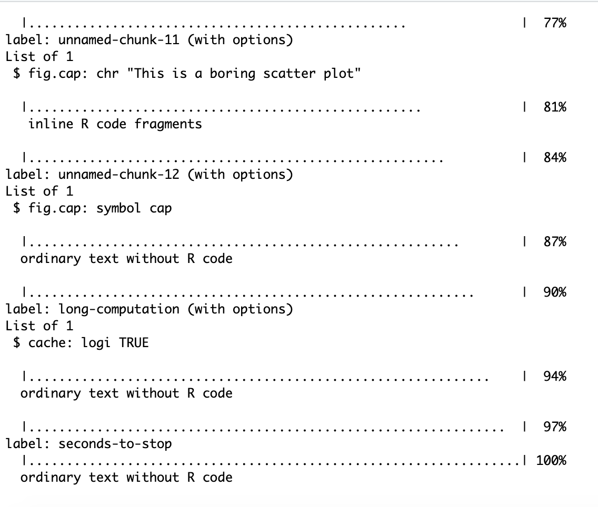

# Suppressing code and output

**Learning objective** 

* `include = FALSE`

## Case study: loading `tidyverse`

If you try to load the `tidyverse` package, you get many messages.


```{r pkg-load}
library(tidyverse)
```

In writing your report, you probably do not want to

1. print the R code; and
1. print all the peripheral messages.

To achieve this you can use the chunk option:

`echo = FALSE, message = FALSE`.

`r emo::ji("question")` **Can you tell which option does what?**

`r emo::ji("wrench")` **Modify the `pkg-load` chunk to hide the code and message outputs.** 

This can be done more succintly using:

`include = FALSE`.

In fact it's equivalent to hiding code and all outputs:

`echo=FALSE, results='hide',` 
`message=FALSE, warning=FALSE,` 
`fig.show='hide'`.


Reference: Yihui has excellent tips like this on [his blog](https://yihui.name/en/2017/11/knitr-include-false/).


# Global chunk options 

**Learning objective** 

* `knitr::opts_chunk$set`

## DRY everytime

Repeating chunk options can be painful in your workflow. If you are say writing `echo = FALSE` for every single chunk, you might as well set the default chunk option to `echo = FALSE`. Remember **don't repeat yourself** (DRY) everytime.

In order to change the default chunk options you can use `knitr::opts_chunk$set(echo = FALSE)`.

You can get the current default by using the following command:

```{r}
knitr::opts_chunk$get()
```

Now if I change it so that `echo = FALSE`

```{r}
knitr::opts_chunk$set(echo = FALSE)
```

then you can see the global default option is `echo = FALSE`:
```{r}
knitr::opts_chunk$get()$echo
```

You can set multiple default options at once. My default chunk option values includes below. (Notice that in the Rmd source file I have to set `echo = TRUE` to overwrite the now default option `echo = FALSE`).

```{r, echo = TRUE}
knitr::opts_chunk$set(
  echo       = TRUE,
  eval       = TRUE,
  warning    = FALSE,
  message    = FALSE,
  cache      = FALSE,
  cache.path ='cache/',
  fig.path   ='figure/',
  fig.align  ='center',
  fig.retina = 2
)
```

`r emo::ji("question")`**What does each of the above options do?**

Hint: Check out https://yihui.name/knitr/options/

With this now we have `echo = TRUE` once again.

Remember that it is good practice to set default chunk options at the *beginning* of your Rmd file just as it is good practice to load all packages needed at the beginning. This makes it easier to quickly see what the expected behaviour of the chunks for anyone (including yourself) looking at the file.


# Customising figures

**Learning objectives** 

* Figure sizes
* Figure captions
* Inserting images 

There is a data set called `cars` that is loaded into R. You can have a look at the data set by typing `cars` into R.

```{r}
cars
```

I can get a scatter plot of the `speed` vs `dist` using `ggplot2`:

```{r}
ggplot(cars, aes(dist, speed)) + 
  geom_point()
```

## Figure sizes

By default the figure width and figure height is 6 inches for `rmdformats::material` output. You can change this to say 1 inch by setting the chunk options `fig.height = 1, fig.width = 1`. The value for `fig.height` and `fig.width` requires to be numeric (in inches).

```{r, fig.height = 1, fig.width = 1}
ggplot(cars, aes(dist, speed)) + 
  geom_point()
```

Another way to scale your image is using `out.width` and `out.height`. These two options can only take character as values and this may depend on the output format. E.g. you can use `".8\\linewidth"`for pdf output (`\linewidth` is a LaTeX command) or `"300px"` for html output. You may also use percentage which scales appropriately for both html and pdf outputs. Below figure we use `out.width = "60%", out.height = "60%"`.

```{r, out.width = "60%", out.height = "60%"}
ggplot(cars, aes(dist, speed)) + 
  geom_point()
```

We can use `fig.width` and `fig.height` with `out.width` and `out.height`. 

```{r, fig.width = 3, fig.height = 3, out.width = "60%", out.height = "60%"}
ggplot(cars, aes(dist, speed)) + 
  geom_point()
```

Getting the figure to "look" right usually requires playing around with these options.

`r emo::ji("question")` *What happens if your code chunk generates multiple figures?**

## Figure alignment

You may have noticed but in the [Global chunk options](#global-chunk-options) section, I've set the `fig.align = "center"` so that the figures will be centered as default. 

The other valid values are `default` (no alignment), `left` and `right`.  Below figure has `fig.align = "left"`.

```{r, fig.width = 3, fig.height = 3, out.width = "60%", out.height = "60%", fig.align = "left"}
ggplot(cars, aes(dist, speed)) + 
  geom_point()
```

`r emo::ji("wrench")` **Try changing the above figure so that the alignment is on the right instead.**

## Figure caption

You can include a figure caption by using the chunk option `fig.cap`.

```{r, fig.cap = "This is a boring scatter plot"}
ggplot(cars, aes(dist, speed)) + 
  geom_point()
```

Chunk options must be written in one line. This means that you cannot add a line break. This can make the line awkwardly long when you need to write a long caption. 
Remember that chunk option values accept valid R expressions. As one work around, you can define a string variable, say `cap`, that contains the long caption as an inline R command. Then you can set option as `fig.cap = cap`. This is how the below caption was generated. Study the Rmd source code for how the caption was generated.


`r cap <- "This is some really long text that may be hard to fit within the chunk option."`


```{r, fig.cap = cap}
ggplot(cars, aes(dist, speed)) + 
  geom_point()
```

If using `bookdown` output formats then there is another way to deal with these long captions [as described in the bookdown book](https://bookdown.org/yihui/bookdown/markdown-extensions-by-bookdown.html#text-references). We'll come back to this later.

## Exporting the figures

If you want to save the figures that you created from your code, these can be saved by setting `fig.path`. Previously we set `fig.path = "figures/"` so you can find all figures generated in the folder `figures` already.

`r emo::ji("question")` **Do you notice something about the figure names in the `figure` folder?** Don't fret if you don't. We'll come back to this point later. 

## Inserting images 

To insert images in markdown, you can use ``. However to apply captions and images resizing as before, you want to insert the image via a chunk using `knitr::include_graphics()`.

The following logo is inserted using markdown syntax:


```{r logo, out.width = "40%"}
knitr::include_graphics("rlogo.svg")
```


# Long computations

**Learning objective** 

* Quick compiling using `cache = TRUE`
* Dangers of caching

## Quicken knitting

When you `knit`, by default it re-evaluates the chunk each time. This can be a pain if you need to constantly `knit` your document and if you have a chunk that requires large computation time.

To quicken the process, setting the chunk option `cache = TRUE` will be helpful. For example, the following chunk will initially take about 10 seconds to compute. The next time though, if the content of the chunk remains unchanged, it will be much less than 10 seconds to compute althought the output results are the same.

```{r long-computation, cache = TRUE}
start <- Sys.time()
Sys.sleep(10)
end <- Sys.time()
print(end - start)
```

The results of the cache are saved by what is set in `cache.path` which we have set globally to `cache.path = 'cache/'` previously. You can find there is a folder called `cache` which contains the cached output.


## Dangers of caching

When you cache, there is some danger that the result that is shown in knitted output is invalid. This may be a result of some previous chunk or external file that has changed since running the cache and directly impacts the results. Thus it is good practice that you run your final document withe `cache = FALSE` to ensure your results are reproducible.

See more about this on [Yihui's blog post](https://yihui.name/en/2018/06/cache-invalidation/).


# Chunk names

**Learning objective** 

* Chunk label rules
* Why label chunks?
* `ref.label` option
* repeating chunks

## Chunk label / names

Avoid spaces and periods in chunk labels as they can cause issues in TeX documents. Instead of using spaces or periods, you are recommended to use "-" as a separator instead, e.g. `clean-data`. You should never label your chunk with a prefix `unnamed-chunk-` as these prefix are used by unlabelled chunks.

Chunk labels is written straight after the engine. E.g. `{r clean-data}` has the chunk label/name `clean-data`.

The following code calculates how many seconds it took for the car to stop. The chunk name is `seconds-to-stop`.

```{r seconds-to-stop}
ftps <- 1.467 * cars$speed # convert to ft per second
seconds_to_stop <- cars$dist / ftps 
summary(seconds_to_stop)
```


## Why name chunks?


### Unnamed chunks

If you do not name a chunk, the chunk will be automatically lablled with a prefix `unnamed-chunk-` to the corresponding unnamed chunk number. E.g. the first unnamed chunk will be labelled `unnamed-chunk-1` then the second unnamed chunk `unnamed-chunk-2` and so on. 

If you later decide to enter a new unnamed chunk between `unnamed-chunk-1` and `unnamed-chunk-2` then the inserted new chunk will now instead become `unnamed-chunk-2` while the previous one `unnamed-chunk-2` will become `unnamed-chunk-3`.


`r emo::ji("wrench")` **Replace [[TODO]] with their corresponding chunk name.**

`r emo::ji("wrench")` **Now insert an unnamed chunk between these chunks with code `knitr::opts_current$get("label")` and knit.**

`r emo::ji("question")` **What do you notice with the chunk names?**


```{r, echo = -2 }
knitr::opts_current$get("label")
cat("This has chunk label [[TODO]]")
```

```{r, echo = -2 }
knitr::opts_current$get("label")
cat("This has chunk label [[TODO]]")
```

### Chunk names make it easier to debug

When you do not name your chunks, it makes it harder to locate the chunk. This can affect debugging of your code. 

E.g. you may have noticed that when you knit your document, you get an output like this If there's an error in your code, you can tell which chunk it is from the label if it has one. 



### Chunk name relates to the exported figure name

The following chunk that generates the red scatterplot is named `red-plot`. 

```{r red-plot}
ggplot(cars, aes(dist, speed)) + 
  geom_point(color = "red", size = 2)
```

You can find this figure called `red-plot-1.png` in the `figure` folder.


### Chunk name relates to the cached output

The following chunk to do a simple computation is called `simple-cache-output`. In the `cache` folder (which we previous set the `cache.path` to be) contains R output data with prefix `simple-cache-output` that relates to this chunk output. 


```{r simple-cache-output}
# this adds numbers 
1 + 1
```

The use of named chunks for cache output is particularly important as unnamed chunk labels may change depending on insertation of a new unnamed chunk and makes previous cache chunk invalid. 


## Reference labels

Instead of repeating chunk code, you may like to `ref.label` the name of the chunk that you want to repeat. This is particularly useful if you want to show the computation code but want to delay showing the chunk output. Chunks that have `ref.label` should be empty.

E.g. the chunk below uses `ref.label = "red-plot"` to insert code from the chunk named `red-plot` (found above) but `eval = FALSE` so it will not show the plot. 

```{r, ref.label = "red-plot", eval = FALSE}
```

You can choose to show the plot later with a chunk option `ref.label = "red-plot"` and `echo = FALSE` (to hide code) as below.

```{r, ref.label = "red-plot", echo = FALSE}
```

When you have only a single `ref.label` then a shorthand is to create an empty chunk with the chunk label as the same as input for `ref.label`. E.g. below chunk is the same as the options `ref.label = "red-plot", eval = FALSE`.

```{r red-plot, eval = FALSE}
```

You can reference multiple chunks by supplying a character vector of chunk labels. E.g. below we have `ref.label = c("red-plot", "simple-cache-output")`.

```{r, ref.label = c("red-plot", "simple-cache-output")}
```
