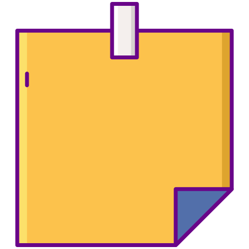
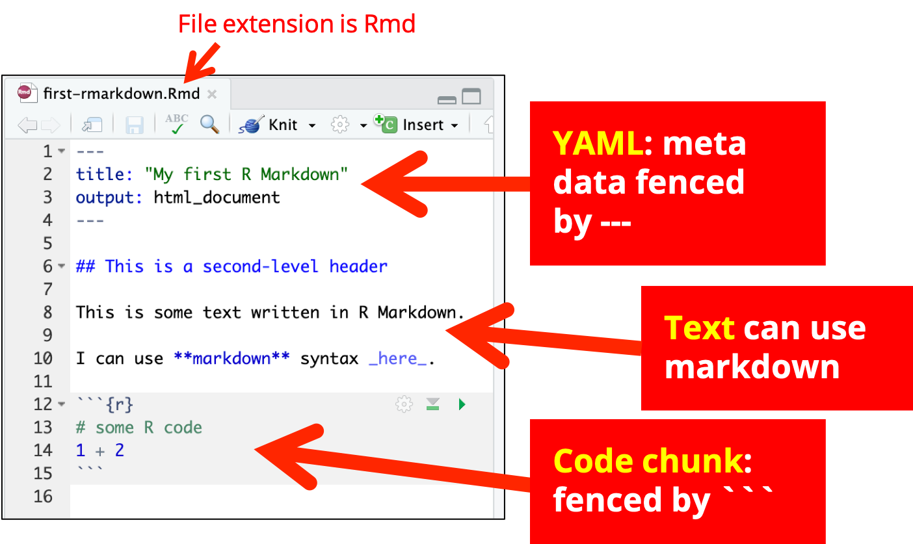
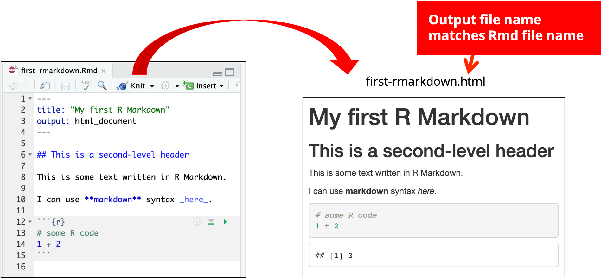
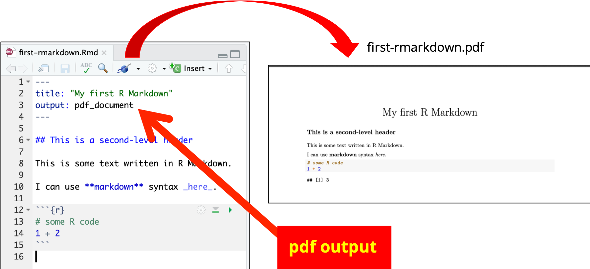

```{r external, child="scripts/setup.Rmd", include=FALSE}
```

```{r titleslide, child="scripts/titleslide.Rmd"}
```
---

class:  question

::: {.item text-align:left; }

**Hi! I'm Emi! `r emo::ji("wave")`**

<br>

I'm a .yellow[lecturer in statistics] at The University of Sydney (soon moving to .yellow[Monash University]). 

<br>

 **Introduce yourself to someone you don't know!**

:::

`r countdown::countdown(3, font_size = "1.3em", color_background="white", color_text = "black", color_border="black")`


---

class: question

# HELP!




Please send SOS signal by attaching sticky note on your laptop.

<br>


Please help your neighbours `r emo::ji("please")`

---


class: challenge font_smaller middle

Open
<br>

http://bit.ly/rmd-combine-2019

<br>

and save a permanent copy to your RStudio Cloud account.

---

class: center

# Schedule

<br>

| Time          | Activity                                |
|:--------------|:----------------------------------------|
| 1:00PM - 1:25PM | Session 1: R Markdown Basics          |
| 1:25PM - 1:30PM | *Break* `r emo::ji("tea")`           |
| 1:30PM - 3:00PM | Session 2A: Reproducible Reports I           |
| 3:00PM - 3:30PM | *Afternoon Tea* `r paste0(emo::ji("coffee"), emo::ji("cake"))`              |
| 3:30PM - 4:10PM | Session 2B: Reproducible Reports II  |
| 4:10PM - 4:15PM | *Break* `r emo::ji("toilet")`           |
| 4:15PM - 5:00PM | Session 3: Pretty Presentations  |


---

# R Markdown Basics





---

# Knitting: <code>Rmd</code> <i class="far fa-file"></i>&nbsp; <i class="fas fa-arrow-right"></i>&nbsp;<code>md</code> <i class="far fa-file"></i>&nbsp;<i class="fas fa-arrow-right"></i> &nbsp;<code>html</code> <i class="far fa-file"></i>




---


# Knitting: <code>Rmd</code> <i class="far fa-file"></i>&nbsp; <i class="fas fa-arrow-right"></i>&nbsp;<code>md</code> <i class="far fa-file"></i>&nbsp;<i class="fas fa-arrow-right"></i> &nbsp;<code>pdf</code> <i class="far fa-file"></i>




---


class: middle question


There are many other .yellow[output formats] possible with R Markdown via Pandoc.

Can you name another 3?


---

class: font_small

# R Markdown under the hood: `html_document`

.indigo[`knitr`] `r emo::ji("package")` does the hard work of converting <code>Rmd</code> <i class="far fa-file"></i>&nbsp; <i class="fas fa-arrow-right"></i>&nbsp;<code>md</code> <i class="far fa-file"></i>
::: grid 

::: item 

````markdown
---
title: "My Report"
output: html_document
---

# Hello

`r ''````{r}
1 + 1
```


````
<p></p>

::: 

::: item 

````markdown
---
title: "My Report"
output: html_document
---

# Hello

`r ''````r
1 + 1
```

`r ''````
## [1] 2
```

````

<p></p>

:::

:::

::: {.pos top:20%;left:20%;}
`Rmd` <i class="far fa-file"></i>
:::
::: {.pos top:20%;left:70%;}
`md` <i class="far fa-file"></i>
:::


---

class: font_small

# R Markdown under the hood: `html_document`

Then .indigo[`rmarkdown`] `r emo::ji("package")` prepares <code>md</code> <i class="far fa-file"></i> for .indigo[`pandoc`] to convert to html <i class="far fa-file"></i>.
::: grid 

::: item 

````markdown
---
title: "My Report"
output: html_document
---

# Hello

`r ''````r
1 + 1
```

`r ''````
## [1] 2
```

````

<p></p>

:::

::: item 

```html

<body>
<div class="container-fluid main-container">
<div class="fluid-row" id="header">
<h1 class="title toc-ignore">My Report</h1>
</div>
<div id="hello" class="section level1">
<h1>Hello</h1>
<pre class="r"><code>1 + 1</code></pre>
<pre><code>## [1] 2</code></pre>
</div>
</div>
</body>
```


:::

:::


::: {.white .font_small .pos bottom:60px; right:10%; width:200px;padding:5px;background-color:rgb(256,160,160, 0.3);border: solid 3px black;	}
<i class="fas  fa-exclamation-triangle"></i> This html file is missing some elements due to restriction of space.
:::

::: {.pos top:20%;left:20%;}
`md` <i class="far fa-file"></i>
:::
::: {.pos top:20%;left:70%;}
`html` <i class="far fa-file"></i>
:::

---

class: font_small

# R Markdown under the hood: .red[`pdf_document`]

Same as before: `knitr` `r emo::ji("package")` converts <code>Rmd</code> <i class="far fa-file"></i>&nbsp; <i class="fas fa-arrow-right"></i>&nbsp;<code>md</code> <i class="far fa-file"></i>
::: grid  

::: item 

````markdown
---
title: "My Report"
output: pdf_document
---

# Hello

`r ''````{r}
1 + 1
```


````
<p></p>

::: 

::: item 

````markdown
---
title: "My Report"
output: pdf_document
---

# Hello

`r ''````r
1 + 1
```

`r ''````
## [1] 2
```

````

<p></p>

:::

:::

::: { .pos top:20%;left:20%; }
`Rmd` <i class="far fa-file"></i>
:::
::: { .pos top:20%;left:70%; }
`md` <i class="far fa-file"></i>
:::

---

class: font_small

# R Markdown under the hood: .red[`pdf_document`]

Then `rmarkdown` `r emo::ji("package")` prepares <code>md</code> <i class="far fa-file"></i> for `pandoc` to convert to .indigo[`tex`] <i class="far fa-file"></i> <i class="fas fa-arrow-right"></i> pdf <i class="fas fa-file-pdf"></i>.
::: grid  


::: item 

````markdown
---
title: "My Report"
output: html_document
---

# Hello

`r ''````r
1 + 1
```

`r ''````
## [1] 2
```

````

<p></p>

:::

::: item 

```latex
\begin{document}
\maketitle
\hypertarget{hello}{%
\section{Hello}\label{hello}}
\begin{Shaded}
\begin{Highlighting}[]
\DecValTok{1} \OperatorTok{+}\StringTok{ }\DecValTok{1}
\end{Highlighting}
\end{Shaded}
\begin{verbatim}
## [1] 2
\end{verbatim}
\end{document}
```


:::

:::

::: {.pos top:20%;left:10%;}
`md` <i class="far fa-file"></i>
:::
::: {.pos top:20%;left:40%;}
`tex` <i class="far fa-file"></i>
:::

::: {.white .font_small .pos bottom:7%; right:10%; width:200px;padding:5px;background-color:rgb(256,160,160, 0.3);border: solid 3px black;	}
<i class="fas  fa-exclamation-triangle"></i> This tex document is missing elements before `\begin{document}` due to restriction of space.
:::

---

class: challenge middle

#Get started with 

`challenge-01.Rmd`

`r countdown::countdown(5, font_size = "1.5em", color_background="white", color_text = "black", color_border="black")`

---

class: challenge middle

# Advanced question

How do you render different output formats at once?


---


```{r checklist, echo = FALSE}
checklist <- c("Make a html document from .Rmd",
               "Make a pdf document from .Rmd",
               "Have some understanding of how R Markdown works under the hood.",
               "Have some understanding of how some R Markdown components works only in specific output formats.")
```

```{r endslide, child="scripts/endslide.Rmd"}
```

```{r, include = FALSE, eval = FALSE}
# not working
# get the following erorr:
#[error] consume error: websocketpp.processor:4 (A message was too large)

pagedown::chrome_print(here::here("slides", "session1.html"),
                       wait = 10, 
                       format = "pdf",
                       timeout = 10)
```


