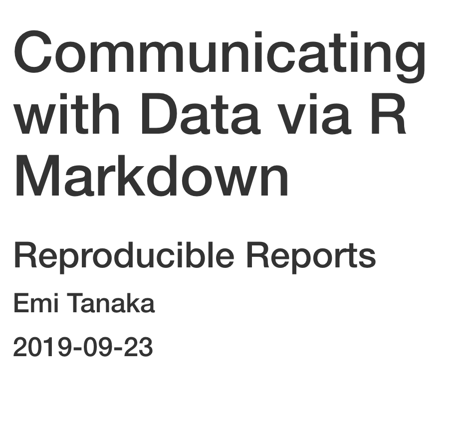
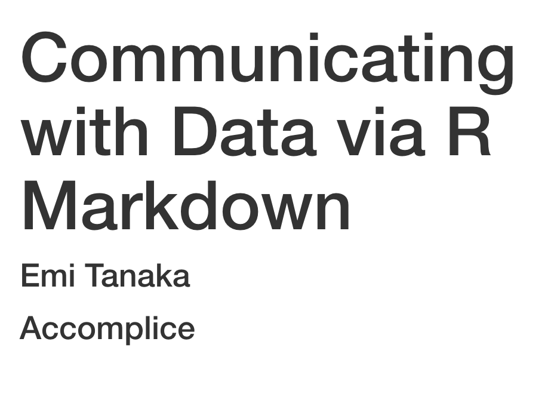
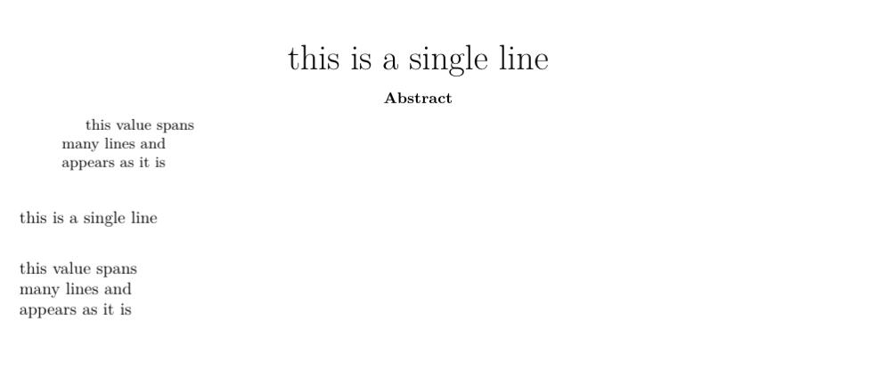
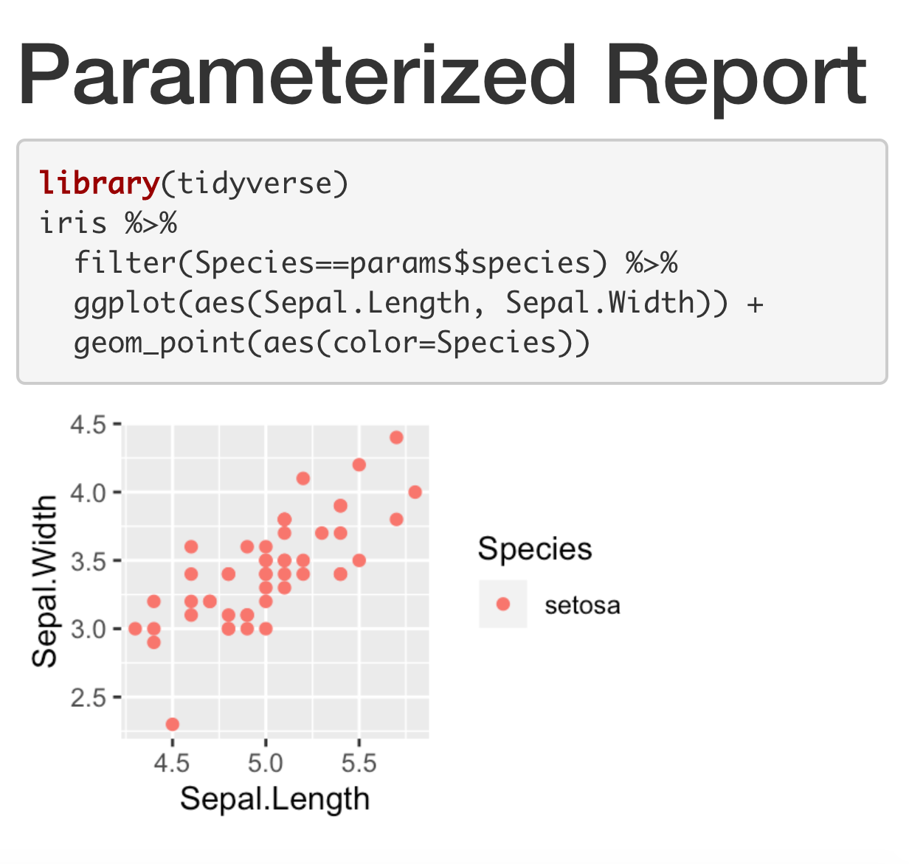
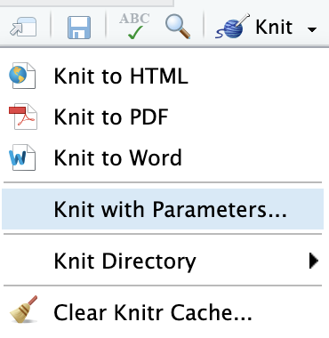
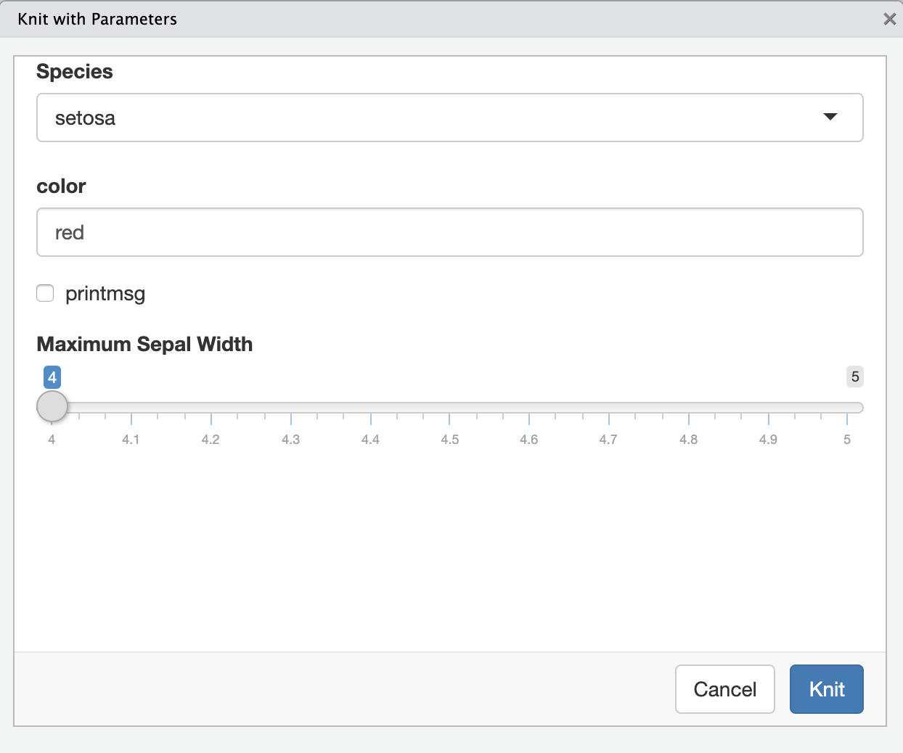

```{r setup, include = FALSE}
library(tidyverse)
```

```{r titleslide, child="scripts/titleslide.Rmd"}
```
---

class: info 

# In a nutshell `r emo::ji("peanut")`

<br><br/>


.font_large[
R Markdown integrates .yellow[**text**] + .yellow[`code`] in one source document with ability to knit to many output formats (via Pandoc).

]

---


::: grid 

::: item 
# Text in Markdown

```markdown
# Header 1
## Header 2

- Unordered list 1 
- Unordered list 2
 
1. Ordered list 1
1. Ordered list 2
 
_This is italic._ *This too.*
__This is bold.__ **This too.**
_**This is bold & italic.**_
```

<p></p>

::: 

::: item 

[Output]{.header .bg-blue .white padding:10px; border: solid 2px black;}

# Header 1
## Header 2

* Unordered list 1 
* Unordered list 2

1. Ordered list 1
1. Ordered list 2
 
_This is italic._ *This too.*
__This is bold.__ **This too.**
_**This is bold & italic.**_

:::

:::

::: {.bottom_abs .width100 .bg-indigo .white padding-left:10px;}
Go to RStudio > Help > Markdown Quick Reference
:::


---

class: info

# Shortcut for inserting code chunk  

::: grid 

::: item

In RStudio .Rmd <i class="far fa-file"></i> press

* Mac: <kbd>⌘</kbd> + <kbd>⌥</kbd> + <kbd>i</kbd> 


* PC: <kbd>Ctrl</kbd> + <kbd>Alt</kbd> + <kbd>i</kbd> 

to insert a chunk of R code

::: font_large

````markdown
`r ''````{r}

```
````

:::
:::

::: item 

:::

:::

---

# Chunk options: <code>echo</code> & <code>eval</code>

::: grid 
::: item 

````markdown
`r ''````{r, echo = FALSE}
plot(speed ~ dist, cars)
```
````
<center>
<i class="fas fa-arrow-down"></i>
</center>

```{r, echo = FALSE, fig.align="center", fig.dim=c(4,4)}
plot(speed ~ dist, cars)
```

<p></p>

::: 

::: item 

````markdown
`r ''````{r, eval = FALSE}
plot(speed ~ dist, cars)
```
````

<center>
<i class="fas fa-arrow-down"></i>
</center>

```{r, eval = FALSE}
plot(speed ~ dist, cars)
```

<p></p>

:::

:::

---

class: question middle

There are many more .yellow[chunk options].

Can you name 5 other ones?

Hint: https://yihui.name/knitr/options/

(We'll explore some later.)


---

class: info

# Valid chunk options

* Chunk options must be written in **one line**, i.e. no line break. 


* All option values must be **valid R expressions**. Exception is the chunk name. E.g.
   * `fig.path = figures/` is not valid but <br>`fig.path = "figures/"` is valid
   * `eval = true` is not valid but<br> `eval = runif(1) > 0.5` is valid

---

class: info

# Chunk names (or labels)

The chunk below is called `plot1`.
````markdown
`r ''````{r plot1}
ggplot(cars, aes(dist, speed)) + geom_point()
```
````

All chunks have a label regardless of whether it is explicitly supplied or not.

<i class="fa fa-exclamation-triangle"></i> Do not include spaces, "_" or punctuation marks in your chunk name!

---


::: pad10

# Inline R Commands


```markdown
Today's date is ``r "r Sys.Date()"``.
```

Today's date is `r Sys.Date()`.

```markdown
The value of $\pi$ is ``r "r pi"``.
```

The value of $\pi$ is `r pi`.

* Note: the inline command needs to be R commands.


* Inline command does *not* `echo` and always `eval`uates.

<p></p>

:::


---

class: challenge middle

# Go through 

* `challenge-02.Rmd`
* `challenge-03.Rmd`
* `challenge-04.Rmd`
* `challenge-05.Rmd`
* `challenge-06.Rmd`


`r countdown::countdown(25, font_size = "1.5em", color_background="white", color_text = "black", color_border="black")`

---

# R Markdown is not just for R

::: grid 

::: item 

````markdown
`r ''````{python, echo = FALSE}
a = [1, 2, 3]
a[0]
```
````

<center>
<i class="fas fa-arrow-down"></i>
</center>

```{python, echo = FALSE}
a = [1, 2, 3]
a[0]
```
<p></p>

:::

::: item 

````markdown
`r ''````{bash, echo = FALSE}
date +%B
```
````
<center>
<i class="fas fa-arrow-down"></i>
</center>

```{bash, echo = FALSE}
date +%B
```
<p></p>
::::

::::

---

class: question middle

Can you name some other engines?

Hint: https://yihui.name/knitr/demo/engines/


---


# YAML - YAML Ain't Markup Language

:::: grid

::: item 

Basic format
```markdown
---
key: value
---
```
:::

::: item 

Example

```
---
title: "Communicating with Data via R Markdown"
subtitle: "Reproducible Reports"
author: "Emi Tanaka"
date: "``r "r Sys.Date()"``"
output: html_document
---
```

There must be a space after "`:`"!
<p></p>
:::

:::

---

# Metadata

All YAML data are stored in `rmarkdown::metadata` as list.

```{r}
rmarkdown::metadata$title
rmarkdown::metadata$author
```

---

class: font_small

# Default (minimal) html output

```
<!DOCTYPE html>
<html xmlns="http://www.w3.org/1999/xhtml">

<head>
<meta name="author" content="Emi Tanaka" />
<meta name="date" content="2019-10-04" />
<title>Communicating with Data via R Markdown</title>
</head>

<body>
<h1 class="title toc-ignore">Communicating with Data via R Markdown</h1>
<h3 class="subtitle">Reproducible Reports</h3>
<h4 class="author">Emi Tanaka</h4>
<h4 class="date">2019-10-04</h4>
</body>
</html>
```
<p></p>

::: { .bubble1 .pos width:300px;left:70%;top:48%;}

html meta data

:::

::: { .bubble1 .pos width:650px;left:43%;top:75%;}

Default html template add special YAML key values to file automatically

:::

::: {.pos top:10px; right:20px;}
output<br>


:::

---

::: pad10

# YAML structure

* White spaces indicate structure in YAML - don't use tabs though!
* Same as R, you can comment lines by starting with `#`.
* YAML is case sensitive.
* A `key` can hold multiple values. 

```markdown
key: 
  - value 1
  - value 2
```

```markdown
key: [value 1, value 2]
```

:::

---

class: font_small

# YAML with multiple key values

```
---
title: "Communicating with Data via R Markdown"
author: 
 - "Emi Tanaka"
 - "Accomplice"
output: html_document
---
```

```
<body>
<h1 class="title toc-ignore">Communicating with Data via R Markdown</h1>
<h4 class="author">Emi Tanaka</h4>
*<h4 class="author">Accomplice</h4> 
</body>
```

<p></p>

::: {.pos top:10px; right:20px;}
output<br>


:::


---

class: question


::: {text-align: left;}

# `key` can contain `key`s


```
---
output: 
  html_document:
    toc: true
    toc_float: true
---
```
<p></p>
What does this do?

:::

(Note: white space is important)

---

class: font_small

# Values spanning multiple lines

```markdown
---
title: >
  this is a\ 
  single line\
  
abstract: |
  this value spans\
  many lines and\
  appears as it is\
  
output: pdf_document
---

``r "r rmarkdown::metadata$title"``
``r "r rmarkdown::metadata$abstract"``
```

::: {.pos top:80px; right:20px;}
output<br>


:::

---

class: challenge middle

# Go through

`challenge-07.Rmd`

`r countdown::countdown(10, font_size = "1.5em", color_background="white", color_text = "black", color_border="black")`

---

class: font_small

# Parametrized Report

````markdown
---
title: "Parameterized Report"
params:
  species: setosa
output: html_document
---

`r ''````{r, message = FALSE, fig.dim = c(3,2)}
library(tidyverse)
iris %>% 
*  filter(Species==params$species) %>% 
   ggplot(aes(Sepal.Length, Sepal.Width)) +
   geom_point(aes(color=Species))
```
````

::: {.pos top:10px; right:10px;}
output<br>


:::

---

class: font_smaller

::: grid
::: item 
# Knit with Parameters
```markdown
---
title: "Parameterized Report"
params:
  species: 
    label: "Species"
    value: setosa
    input: select
    choices: [setosa, versicolor, virginica]
  color: red
  max:
    label: "Maximum Sepal Width"
    value: 4
    input: slider
    min: 4
    max: 5
    step: 0.1
output: html_document
---
```

:::

::: item 



````markdown
`r ''````{r, message = params$printmsg, fig.dim = c(3,2)}
library(tidyverse)
iris %>% 
  filter(Species==params$species) %>% 
  filter(Sepal.Width < params$max) %>% 
  ggplot(aes(Sepal.Length, Sepal.Width)) +
  geom_point(aes(color=Species), 
             color = params$color)
```
````


:::

:::

---

class: font_smaller

# Shiny Report Generator
::: grid
::: item 
```markdown
---
title: "Parameterized Report"
params:
  species: 
    label: "Species"
    value: setosa
    input: select
    choices: [setosa, versicolor, virginica]
  color: red
  max:
    label: "Maximum Sepal Width"
    value: 5
    input: slider
    min: 4
    max: 5
    step: 0.05
output: html_document
---
```

:::

::: item 

# &nbsp;




:::

:::

---

class: font_smaller

# R Markdown via Command Line

::: grid 

::: item 

`demo-render.Rmd`

````markdown
---
title: "Parameterized Report"
params:
  species: setosa
output: html_document
---

`r ''````{r, message = FALSE, fig.dim = c(3,2)}
library(tidyverse)
iris %>% 
*  filter(Species==params$species) %>% 
   ggplot(aes(Sepal.Length, Sepal.Width)) +
   geom_point(aes(color=Species))
```
````

:::

::: item 

You can knit this file via R command by using `render` function:

```{r, eval = FALSE}
library(rmarkdown)
render("demo-render.Rmd")
```

You can overwrite the YAML values by supplying arguments to `render`:

```{r, eval = FALSE}
library(rmarkdown)
render("demo-render.Rmd", 
       output_format = "pdf_document",
       params = list(species = "virginica"))
```


:::

:::


---

class: challenge middle

# Go through

`challenge-08.Rmd` and `challenge-09.Rmd`

`r countdown::countdown(10, font_size = "1.5em", color_background="white", color_text = "black", color_border="black")`

---

# Themes: `html_document`  

<!-- The Modal -->
<div id="myModal" class="modal">
  <div id="caption"></div>
  <span class="close" onclick="document.getElementById('myModal').style.display='none'">&times;</span>
  <iframe class="modal-content" id="img01"></iframe><br>
</div>

You can change the look of the html document by specifying themes:
::: grid 

::: item 

* `default`  
* `cerulean`  
* `journal`   
* `flatly`  
* `darkly`  
* `readable`  
* `spacelab`  
* `united`  

:::

::: item 


* `cosmo`  
* `lumen`  
* `paper`  
* `sandstone`  
* `simplex`  
* `yeti`  
* `NULL`   

:::

::: item 


```markdown
output: 
  html_document:
    theme: cerulean
```

These [bootswatch](https://bootswatch.com/) themes attach the whole bootstrap library which makes your html file size larger.

:::

:::

---

# `prettydoc` 

<!-- The Modal -->
<div id="myModal2" class="modal">
  <div id="caption2"></div>
  <span class="close" onclick="document.getElementById('myModal2').style.display='none'">&times;</span>
  <iframe class="modal-content" id="img02"></iframe><br>
</div>

::: grid 

::: item 

`prettydoc` `r emo::ji('package')` is a community contributed `theme` that is light-weight:

* `cayman`  
* `tactile`  
* `architect`  
* `leonids`  
* `hpstr`  


:::

::: item 


```markdown
output: 
  prettydoc::html_pretty:
    theme: cayman
```

See more about it below:

https://prettydoc.statr.me/

:::

:::


---

# `rmdformats`

<!-- The Modal -->
<div id="myModal3" class="modal">
  <div id="caption3"></div>
  <span class="close" onclick="document.getElementById('myModal3').style.display='none'">&times;</span>
  <iframe class="modal-content" id="img03"></iframe><br>
</div>


::: grid 

::: item 

`rmdformats` `r emo::ji('package')` contains four built-in `html` formats: 


* `readthedown`  
* `html_clean`  
* `html_docco`  
* `material`  

:::

::: item 

You can use these formats by simply specifying the output in YAML as below:


```markdown
output: rmdformats::readthedown
```

See more about it below:

https://github.com/juba/rmdformats

:::

:::

---

# `rticles` - LaTeX Journal Article Templates

<!-- The Modal -->
<div id="myModal4" class="modal">
  <div id="caption4"></div>
  <span class="close" onclick="document.getElementById('myModal4').style.display='none'">&times;</span>
  <iframe class="modal-content" id="img04"></iframe><br>
</div>
::: grid
::: item 
* `acm` 
* `acs` 
* `aea` 
* `agu` 
* `amq` 
* `ams` 
* `asa` 
* `biometrics` 
* `copernicus` 


:::

::: item 

* `elsevier` 
* `frontiers` 
* `ieee` 
* `jss` 
* `mdpi` 
* `mnras` 
* `peerj` 
* `plos` 

:::

::: item 
* `pnas` 
* `rjournal` 
* `rsos` 
* `rss` 
* `sage` 
* `sim` 
* `springer` 
* `tf` 

::::

::::


::: {.bottom_abs .width100 .bg-indigo .white padding-left:10px;}
Go to RStudio > File > New File > R Markdown ... > From Template
:::


---


# External Files in Templating

::: grid

::: item 

* When using `rticles`, each journal usually require external files (e.g. `cls` or image files).
* These external components are stored within the package.
* If you are drafting an Rmd template with external components then you need to extract these to your folder first. 

::: 

::: item bg-gray

**GUI**

* `RStudio > File > New File > R Markdown ... > From Template`

**Command line**

```{r, eval = FALSE}
rmarkdown::draft("file.Rmd", 
 template = "biometrics_article",
 package = "rticles")
```


:::

:::


---

class: info

# More customisation needed?

<br>

Default templates for many output are found at

<br>

<center>

<a href="https://github.com/jgm/pandoc-templates">https://github.com/jgm/pandoc-templates</a>

</center>

<br>

We'll go through the latex template.

---

I found this nice latex template online. 

::: grid 

::: item 

You can see it at `main.pdf`.

<center>
<iframe src="exercises/demo/main.pdf" width = "90%", height = "500px"></iframe>
</center>

:::

::: item 

It was compiled from `main.tex`.

<center>
<iframe src="exercises/demo/main.tex" width = "90%", height = "500px"></iframe>
</center>

:::

::::

::: {.bottom_abs .width100 .bg-indigo .white padding-left:10px;}
Find `main.tex` and `main.pdf` in `demo` folder.
:::

---

class: middle question

How do I use this template so that I can write contents from an Rmd file instead?

---

# Templating 

We will use 

```markdown 
---
output: 
  pdf_document: 
    template: main.tex
---

But nothing written in the body shows up in the output!
```

--

You need to add `$body$` in the latex template file where you want the body of the md file to appear. 

---

class: font_smaller pad10

# Templating: few more tweaks

* R Markdown needs a few more special tweaks before `\begin{document}` in latex template:

```latex
\IfFileExists{bookmark.sty}{\usepackage{bookmark}}{\usepackage{hyperref}}
$if(highlighting-macros)$
$highlighting-macros$
$endif$
```

* These are *minimum* tweaks needed for a LaTeX template.
* You can find common tweaks (including for beamer) at 
<a href="https://github.com/jgm/pandoc-templates">https://github.com/jgm/pandoc-templates</a>
* You can define your own tweaks but it is better practice to use the ones defined in pandoc template rather than trying to reinvent the wheel.

---

class: font_smaller

# How pandoc template works: `key`

::: grid 

::: item 

`Rmd` <i class="fas fa-file"></i>

```markdown
---
title: "COMBINE 2019"
author: "Emi Tanaka"
output:
  pdf_document: 
    template: "template.tex"
---
```

YAML meta data can be used by surrounding `key` with $.

:::

::: item 

`template.tex` <i class="fas fa-file"></i>

```latex

\documentclass{article}
\title{$title$}
\author{$author$}
\date{}

\begin{document}

\maketitle

\end{document}

```

::: {.center font-family:"Computer Modern"!important;}

.font_medium[COMBINE 2019]<br>
Emi Tanaka

:::

:::

:::

---

class: font_smaller

# How pandoc template works: if statements

::: grid 

::: item 

`Rmd` <i class="fas fa-file"></i>

```markdown
---
title: "COMBINE 2019"
author: "Emi Tanaka"
output:
  pdf_document: 
    template: "template.tex"
---
```

Simple "if null statements".

:::

::: item 

`template.tex` <i class="fas fa-file"></i>

```latex

\documentclass[
$if(fontsize)$
$fontsize$,
$endif$
]{article}
\title{$title$}
\author{$author$}
\date{}

\begin{document}

\maketitle

\end{document}

```


:::

:::

---

class: font_smaller

# How pandoc template works: accessing list

::: grid 

::: item 

`Rmd` <i class="fas fa-file"></i>

```markdown
---
title: "COMBINE 2019"
author:
 - name: "Rachel Wang"
   email: "rachel.wang@sydney.edu.au"
 - name: "Connor Smith"
   email: "connor.smith@sydney.edu.au"
output:
  pdf_document: 
    template: "template.tex"
---
```

Here it will become 

.font_small[`\author{Rachel Wang \and Connor Smith}`]

:::

::: item 

`template.tex` <i class="fas fa-file"></i>

```latex

\documentclass{article}
\title{$title$}
\author{
$for(author)$
$author.name$$sep$ \and 
$endfor$
}
\date{}

\begin{document}

\maketitle

\end{document}

```


:::

:::


---

class: challenge middle

# Go through

`challenge-10.Rmd`

`r countdown::countdown(5, font_size = "1.5em", color_background="white", color_text = "black", color_border="black")`


---

class: pad10

# Cross Reference


::: grid 

::: item 

* When you make a header via Rmd
```
# Some Header
```
 an id is created automatically.
* The id is created by replacing .red[space with `-`] and making it .red[all lower case].
* Now you can link to this header by `[some text](#some-header)`.
* Cross references work for both pdf and html outputs.

::: 

::: item 

<center>
<iframe src="exercises/demo/demo-header.html" width = "90%", height = "500px"></iframe>
</center>

:::

:::


---


class: pad10

# Direct Reference for `html`


::: grid 

::: item 

* For `html` output, you can also give a link directly to the relevant section.
* E.g. open `demo-header.html` in the `demo` folder in a web browser. 
* Append say `#chicken-data` to the url. It should look like 
.center[
`demo-header.html#chicken-data`
]
* It should have taken you to straight to the corresponding header.

::: 

::: item 

:::

:::

---

class: pad10

# User-defined id


::: grid 

::: item 

* You can define your own id by appending `{#your-id}`.

```markdown
# Some header {#header1}
```
* Now you can link to this header with the id `header1`.
* Note there should be no space in the id name!

::: 

::: item 

:::

:::


---

class: pad10 font_smaller

# Bibliography

* BibTeX citation style format is used to store references in `.bib` files.
* Remember that you can get most BibTeX citation for R packages `citation` function. (Scroll below to see the BibTeX citation).

.scroll-350[
```{r}
citation("xaringan")
```
]

---

# Citations


::: grid 

::: item 

* You can include BibTeX by specifying the `bib` file at YAML as:

```markdown
bibliography: bibliography.bib
```


[@bibtex-key] <i class="fas fa-arrow-right"></i> (Author et al. 2019)

or 

@bibtex-key <i class="fas fa-arrow-right"></i> Author et al. 2019

* See `demo-citation.Rmd` in the demo folder.


::: 

::: item 

:::

:::


---

class: question middle 

.yellow[R Markdown] is such an *indispensible tool* for making documents, especially if you have plan to *include statistical output*.


How do you use (or plan to use) <br>R Markdown?

---

class: info

# People that made R Markdown possible

The development of R Markdown is largely thanks to


* .yellow[Yihui Xie] <br>*Software Engineer at RStudio*<br> for `knitr`


* .yellow[John MacFarlane] <br>*Professor of Philosophy at UC Berkeley*<br> for `pandoc`


* and .yellow[many contributors] behind the development of these tools.


---

```{r checklist, echo = FALSE}
checklist <- c("Understand how YAML changes .Rmd",
               "Understand how to manipulate chunks in .Rmd",
               "Understand how to change the template in .Rmd",
               "Understand how to cross-reference and do citations")
```
```{r endslide, child="scripts/endslide.Rmd"}
```


