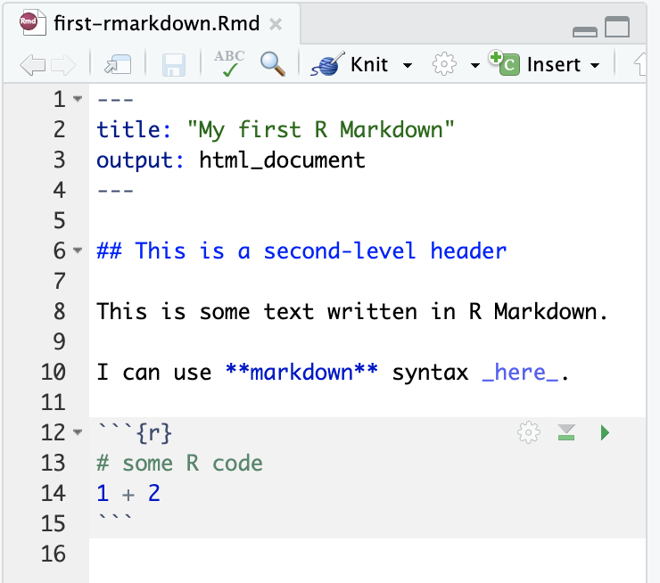

```{r external, child="setup.Rmd", include=FALSE}
```

```{r titleslide, child="titleslide.Rmd"}
```
---

# R Markdown Basics

::: grid 

::: item 



:::

::: item 

:::

:::

::: {.pos width:50px; border: solid 2px red;top:25%;left:16.5%; height:25px;}
:::

::: {.pos color:red;top:13%;left:16.5%;width:1000px;}

File extension is Rmd

:::


::: { .bubble1 .pos width:600px;left:40%;top:35%;}

YAML: meta data fenced by `---`

:::

::: { .bubble1 .pos width:550px;left:50%;top:60%;}

Text: can use `markdown` syntax

:::

::: { .bubble1 .pos width:550px;left:25%;top:80%; }

Code chunk fenced by ```

:::

---
# Test

::: grid 

::: item 


:::

::: item 

:::

:::


---

# Test


---


---


```{r checklist}
checklist <- c("Do this")
```

```{r endslide, child="endslide.Rmd"}
```

